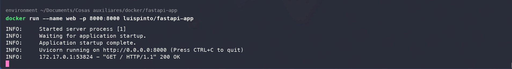
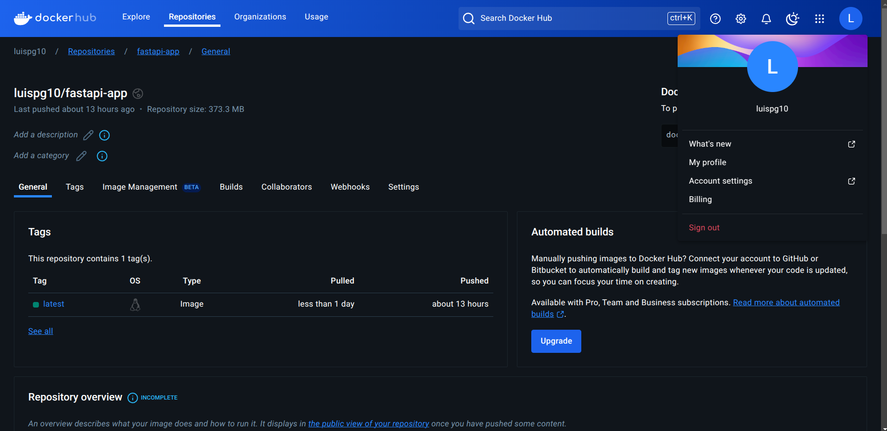

# Taller de docker para la contenerización de aplicación hecha en python con fastapi

## Construir la imagen

```sh
docker build . -t luispinto/fastapi-app
```

## Ejecutar el contenedor

```sh
docker run -d --name web -p 8000:8000 luispinto/fastapi-app
```

## Ejemplo



## Imagen en Dockerhub


